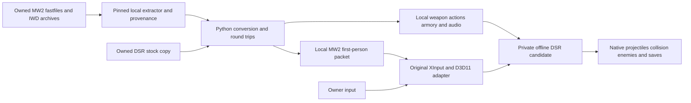

# Native host, local guest assets

DSR remains the running game. The asset pipeline converts owned MW2 source data into local DSR-compatible world weapons/animations and a separate first-person packet. The native adapter coordinates M9 intent and confirmed native shot receipts; it does not replace the host's enemy simulation or write target HP.

`dsr_mw2/` contains original parsers, authoring math, provenance, loadout construction and isolation/launch logic. `native/` contains original C++/assembly integration and source ESD definitions. `tools/` contains source-build, conversion and bounded diagnostic entry points. `tests/` uses synthetic fixtures; retail material is not included.

The virtual magazine tracks a loaded subset of actual native bolt inventory. A native ammo transition confirms a shot before recoil/round bookkeeping. Reload follows native action/animation state. Death, equipment change, focus loss and expired trial contexts invalidate ownership. These are bounded M9 mechanics; they do not establish complete IW4 simulation parity.

The renderer has its own first-person transforms/depth, uses D3D11 deferred commands and restores immediate-context state. It hides the native character only during owned aim after a healthy viewmodel frame. Static hooks are pinned to the exact executable. These mechanisms are implemented, but the latest renderer's actual native integration still needs acceptance.

`owner_test` stages only private outputs, uses temporary overrides, acquires the existing renderer gate, marks owner-only play and restores the baseline when private processes close. It maintains separate stock, M9 and disposable save banks. Ordinary owner play must never become an agent-input target.

Historical authoring variants remain useful for diagnosing animation/container behavior. Three observed startup-crashing packages are blocked by sanitized file fingerprints. A previous PCM FSB experiment is also explicitly rejected; current audio uses the codec-matched MPEG path. Do not remove those guards merely to make a build proceed.
